<!-- COVER PAGE -->

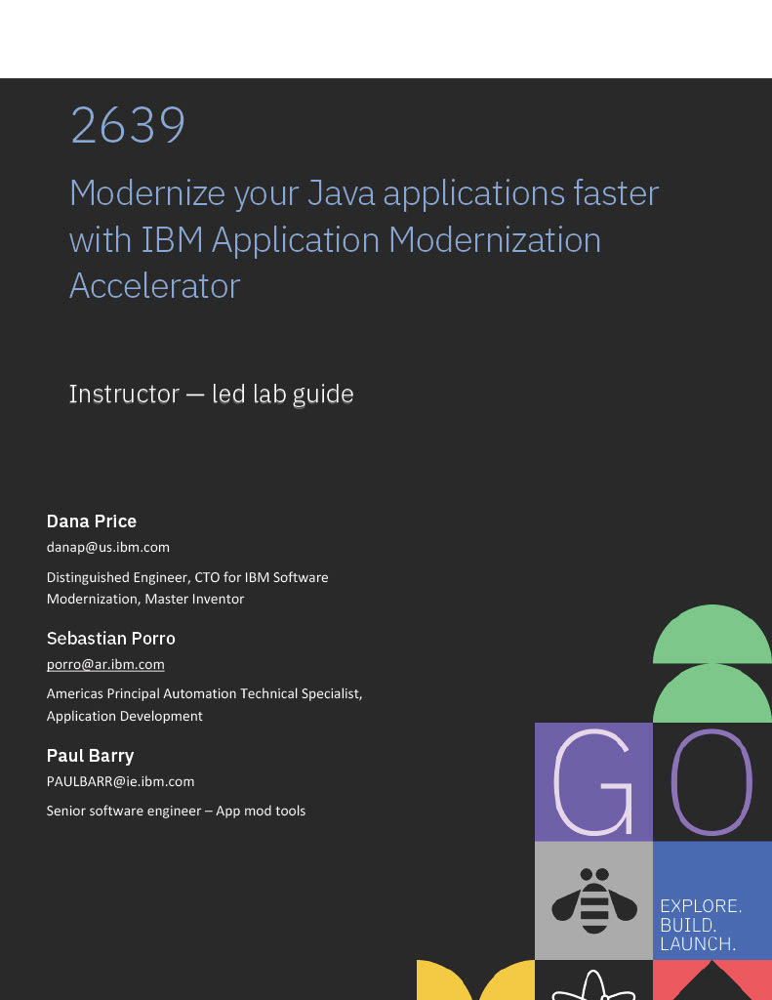

---

<!-- NOTICES & DISCLAIMERS -->

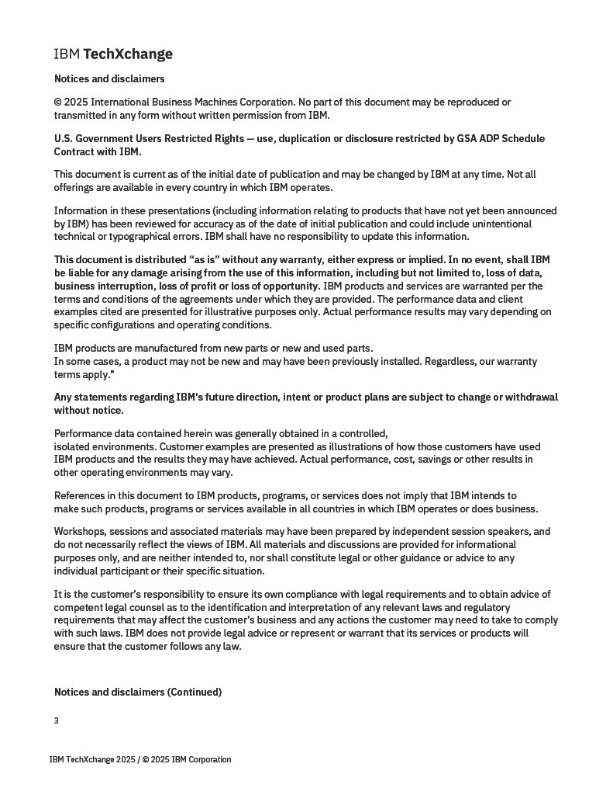

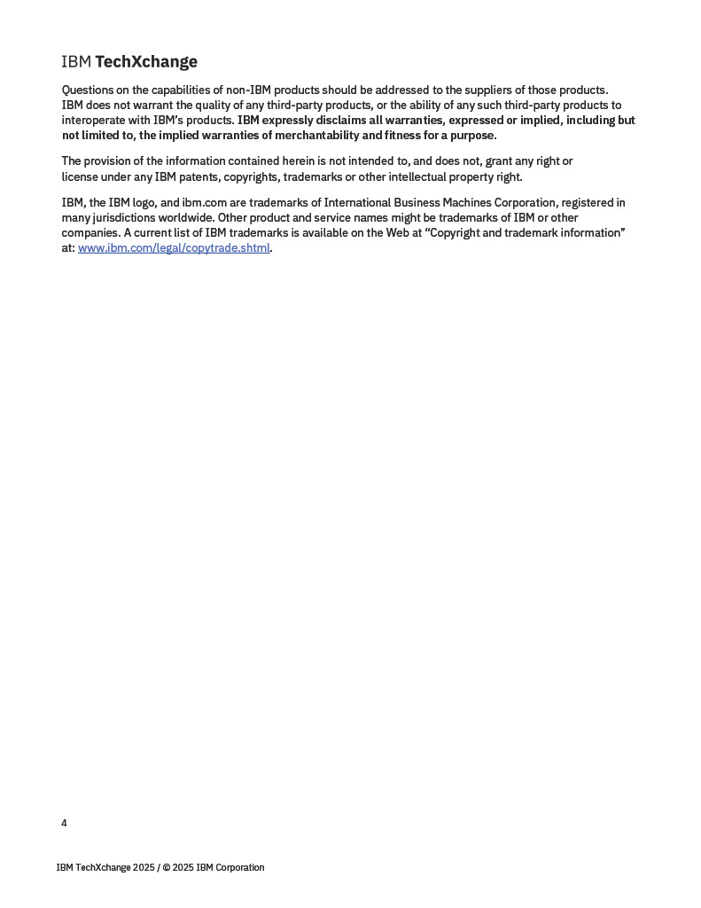

---

# Lab 1456
# Modernize your Java applications faster with IBM Application Modernization Accelerator and IBM Bob

## Table of Contents

1. [Introduction](#11-introduction)
2. [About this hands-on lab](#12-about-this-hands-on-lab)
3. [Using the lab environment](#2-using-the-lab-environment)
   - 2.1 [Logging in](#21-logging-in)
   - 2.2 [Accessing software](#22-accessing-software)
   - 2.3 [Sending text to the VM](#23-sending-text-to-the-vm)
   - 2.4 [Getting this guide](#24-getting-this-guide)
3. [Modernizing your whole Java estate with Application Modernization Accelerator (AMA)](#3-modernizing-your-whole-java-estate-with-application-modernization-accelerator-ama)
   - 3.1 [Launching Application Modernization Accelerator](#31-launching-application-modernization-accelerator)
   - 3.2 [Visualization and Assessment](#32-visualization-and-assessment)
     - 3.2.1 [Taking the tour](#321-taking-the-tour)
     - 3.2.2 [Analyzing ModResorts](#322-analyzing-modresorts)
   - 3.3 [Download the migration plan](#33-download-the-migration-plan)
4. [Modernizing the runtime with IBM Bob — Liberty Modernization](#4-modernizing-the-runtime-with-ibm-bob--liberty-modernization)
   - 4.1 [Opening the ModResorts project in IBM Bob](#41-opening-the-modresorts-project-in-ibm-bob)
   - 4.2 [Modernizing to Liberty using the AMA migration plan](#42-modernizing-to-liberty-using-the-ama-migration-plan)
   - 4.3 [Testing the modernized application on Liberty](#43-testing-the-modernized-application-on-liberty)
5. [Getting help and troubleshooting](#5-getting-help-and-troubleshooting)
   - 5.1 [Reach out to the lab instructor](#51-reach-out-to-the-lab-instructor)
   - 5.2 [Common troubleshooting tips](#52-common-troubleshooting-tips)
6. [Lab Reference Materials](#6-lab-reference-materials)

---

## 1. Introduction

Application Modernization Accelerator (AMA) is a modernization tool designed to scan and discover your entire Java application estate. Applications are scanned in place to collect their configuration, producing a detailed picture of the connections between applications, databases, and queues across the estate.

Analysis is provided to identify the challenges of moving to a range of different runtime destinations. Common code across the estate is identified to ensure the work of modernization is only done once. Guidance is provided on how to build modernization momentum by concentrating on the applications that share common code, so that code changes help to modernize as many applications as possible as quickly as possible.

The estate-wide view — spanning scanning, analysis, and modernization implementation — allows for accurate planning, risk assessment, and evaluation of the return on investment for each potential destination.

IBM Bob is an AI-powered development environment built on VS Code. In this lab you will use the **Bob Java Modernization Premium Package**, which provides specialized workflows:

- **Liberty Modernization** — analyzes your application and applies automated code changes required to move from WebSphere Application Server traditional to Liberty, using an AMA migration plan to guide the process.

<!-- PLACEHOLDER: Replace the image below with the final "How AMA and IBM Bob work" diagram page when available -->

> **TODO:** Insert "How AMA and IBM Bob work" diagram here.

In this lab the installation of AMA and the execution of the Discovery Tool has already been completed for you.

### 1.2 About this hands-on lab

The main objective of this hands-on lab is to present an end-to-end overview of the capabilities of AMA and IBM Bob, and to explicitly demonstrate how these tools together can quickly and easily modernize Java applications.

**Liberty Modernization:** You will use AMA to assess the ModResorts application and download a migration plan. You will then use IBM Bob's Liberty Modernization workflow to apply automated code changes that move ModResorts from WebSphere Application Server traditional to Liberty. The starting point for this modernization is a Java EE 7 / Java SE 8 application — the minimum requirement for Liberty migration.

Modernization is a complex area with many conflicting requirements. The goal is always to modernize as much as possible as quickly as possible, but in practice modernization is "one size fits none." AMA and IBM Bob are designed to let you develop a strategy that best suits your business needs and then to accelerate its implementation.

---

## 2. Using the lab environment

The lab environment has already been created with all the necessary data, tools, and software that you require.

### 2.1 Logging in

Click anywhere on the screen to get the login prompt.

Use the following credentials:

- **User:** `itzuser`
- **Password:** `IBMDem0s`

### 2.2 Accessing software

Use the Activities menu to access available software:

1. Click **Activities** at the top left.
2. The software you will use includes:
   - **Firefox** — for accessing AMA and the WAS admin console
   - **IBM Bob** — the AI-powered IDE for code modernization
   - **Terminal** — for running commands

### 2.3 Sending text to the VM

When copying commands from this guide into the VM:

1. Click where you want to paste the text.
2. Use standard clipboard paste or the text send tool in your console toolbar.

### 2.4 Getting this guide

This guide is available at:

**https://github.com/ManojTauro/tx-ama-bob-lab-1456**

---

## 3. Modernizing your whole Java estate with Application Modernization Accelerator (AMA)

AMA is designed to accelerate the modernization of your whole Java estate. In this lab you will take on the role of the modernization architect tasked with modernizing **InstantPayments**, an aging application infrastructure. The estate contains a mix of WebSphere ND 8.5.5 and 9.0.5, with Java versions ranging from 1.6 to 1.8, running on a variety of RHEL systems.

### 3.1 Launching Application Modernization Accelerator

Application Modernization Accelerator (AMA) is already installed and typically running.

Let's check if AMA is already started. This can be validated by reviewing if the related podman containers are started.

1. Click **Activities** at the top left and open **Terminal**.

   

   The terminal window opens.

   

2. Access the AMA launch script to verify if AMA is started or not:

   ```bash
   cd ~/usr/IBM/application-modernization-accelerator-local-*
   ./launch.sh
   ```

   Check the status of AMA:

   - If AMA **is available** (see screenshot below), enter **q** to quit the menu and keep AMA running.

     

   - If AMA is **not running** (see screenshot below), enter **5** to start AMA.

     

   Wait until AMA has started and the URL is displayed.

   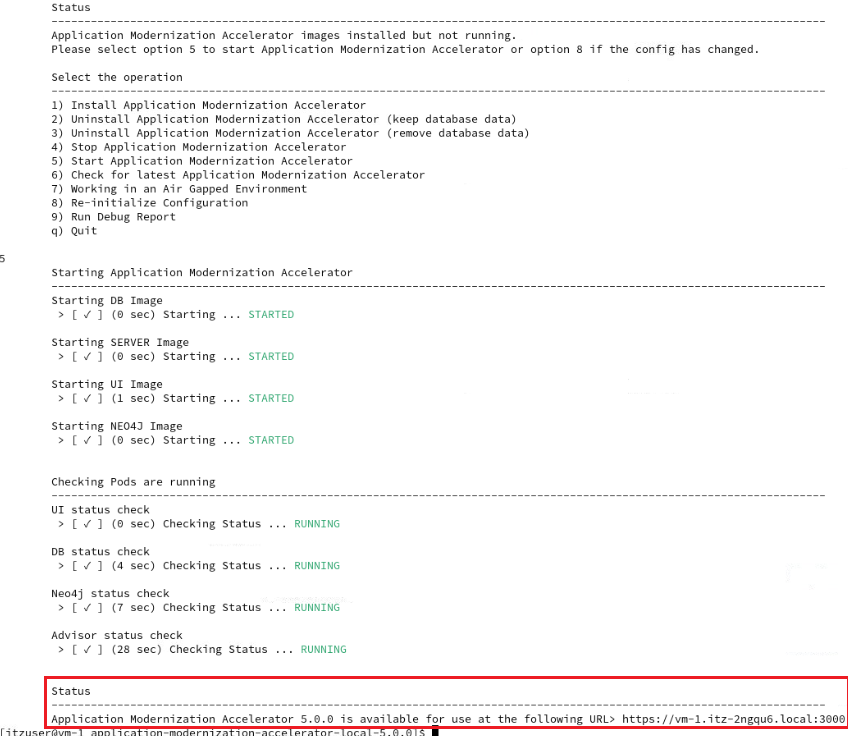

3. Open **Firefox** from the Activities bar. AMA is available as a bookmark in the toolbar — click **AMA**.

   Alternatively, navigate directly to: **https://localhost:3000**

### 3.2 Visualization and Assessment

The visualization gives you a view of all your applications and their connections. This is very useful for understanding how applications relate to each other and to shared infrastructure such as databases and queues.

#### 3.2.1 Taking the tour

To see the capabilities of the visualization we have a guided tour available.

1. In Firefox, AMA should open to the default page. Click on the **TX2026** workspace.
2. Click **Take a tour** in the top right-hand corner of the screen and follow the guided walkthrough.

#### 3.2.2 Analyzing ModResorts

We will now focus on the ModResorts application.

1. Click on **Applications** in the left nav to return to the full estate view.
2. Click on the **Visualization** tab.
3. In the Overview panel on the right-hand side, click **Apps** on the switcher and type `mod` in the search bar.
4. Click on **modresorts-2_0_0_war.ear** in the list.
5. The application node is highlighted in the visualization. Notice that this application has **no connections** to databases or messaging queues, which greatly simplifies its modernization and deployment.
6. In the **Overview** panel on the right-hand side, click on the **modresorts-2_0_0_war.ear** hyperlink. A summary panel opens showing the application's complexity, estimated effort, and a **Details** button.
7. You can see the application is listed as **Moderate** complexity with an estimated effort of **1.5 days**. Click the **Details** button.
8. The application is marked with a complexity of **Moderate** and code changes **Part-automated**. IBM Bob will handle all of the required code changes automatically.
9. On the left-hand side click on **Required code changes**. The screen will scroll down and show the configuration necessary to automate the code changes. We will use IBM Bob to apply these automatically.
10. Scroll down to the **Issues** section. Review the Technology Issues listed. Issues marked **Critical** must be resolved before the application will run on Liberty. Issues marked **Informational** are expected to work but may behave unexpectedly — address these only if problems are found during testing.

ModResorts has no connections to external systems and IBM Bob will handle all code changes automatically — making it an excellent first application to modernize.

### 3.3 Download the migration plan

We will now download the migration plan for ModResorts, which IBM Bob will use to guide the Liberty modernization.

1. Click on the **View migration plan** button in the top right-hand corner of the ModResorts details page.
2. Click the **Download plan** button. Save the file that is generated — you will need it in the next section.

---

## 4. Modernizing the runtime with IBM Bob — Liberty Modernization

We will now use IBM Bob's **Liberty Modernization** workflow from the Java Modernization Premium Package to apply the code changes identified by AMA and move ModResorts to Liberty.

The starting state of the ModResorts application is:
- **Application server:** WebSphere Application Server traditional ND 9.0.5
- **Java EE version:** Java EE 7
- **Java SE version:** Java SE 8

These are the minimum requirements for Liberty migration.

### 4.1 Opening the ModResorts project in IBM Bob

The ModResorts source code has been pre-cloned to your home directory.

1. Click **Activities** and open **IBM Bob**.
2. Choose **File → Open Folder** and navigate to:
   ```
   /home/itzuser/Student/modresorts-project
   ```
3. Click **Open**. The ModResorts project will load in the Explorer panel on the left.
4. Ensure the **Bob chat panel** is open on the right-hand side. If it is not visible, click the **Toggle Secondary Side Bar** button in the top-right corner of the window (or press **⌥⌘B**).

   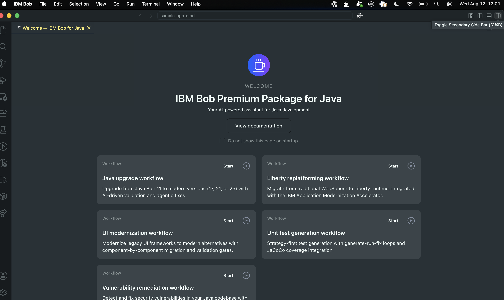

### 4.2 Modernizing to Liberty using the AMA migration plan

**Step 1 — Open the Bob Workflows panel**

1. In the Bob chat panel, click the **Start Workflow** button (▶) in the top-right corner of the panel.

   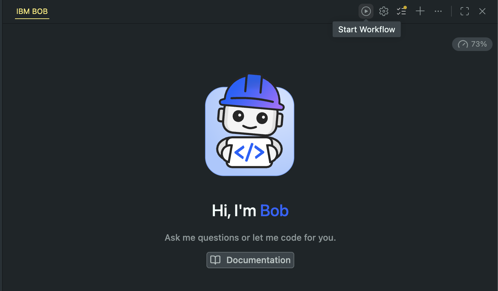

2. The **Bob workflows** panel opens, listing all available workflows. You will see **Java Modernization** at the top with a **Start** button.

   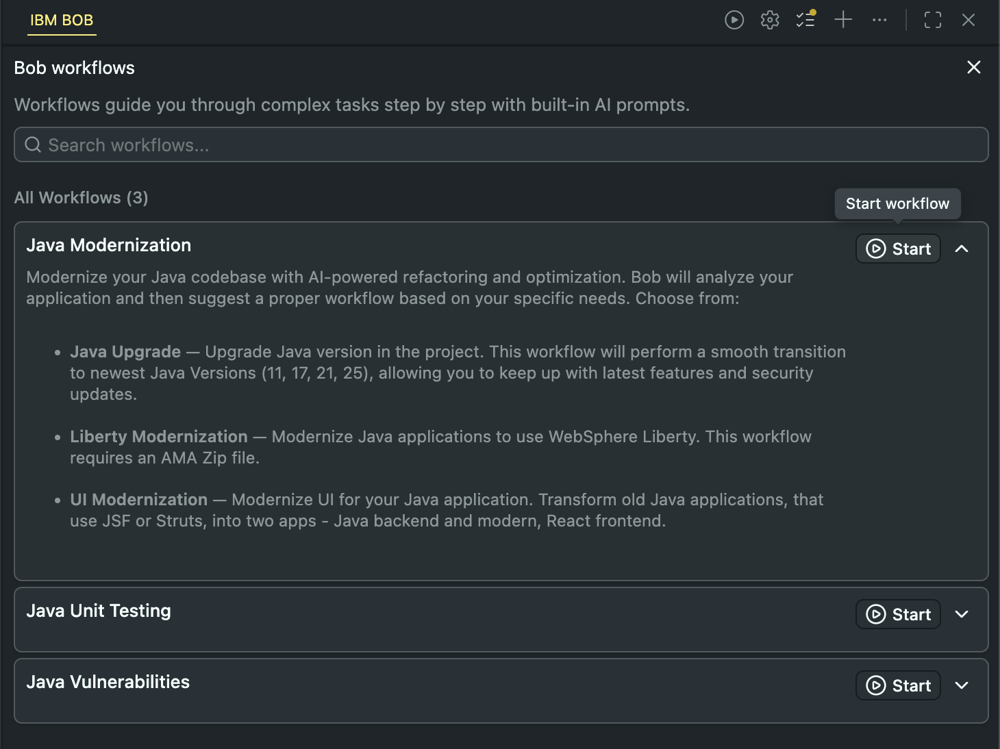

3. Click **Start** next to **Java Modernization**.

**Step 2 — Select Liberty Modernization**

4. Bob performs an initial build and presents the **Flow Selection** screen (step 2/3). Under **Modernization Type**, select **Liberty Modernization** — *Replatform your Java application to Liberty*.

   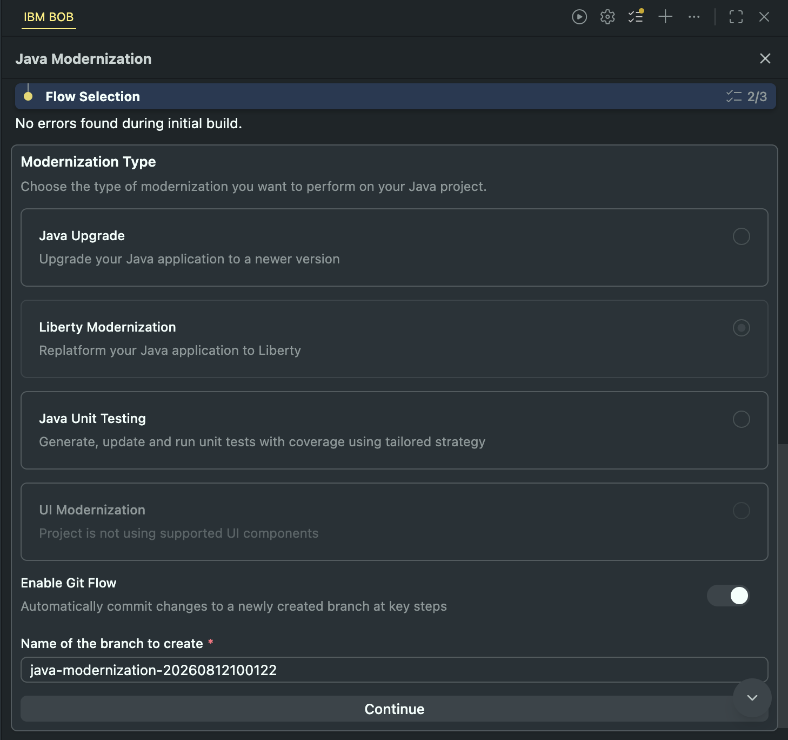

5. **Enable Git Flow** is toggled on by default. Leave it enabled — Bob will automatically create a new branch, commit changes at key steps, and ensure the build succeeds. The branch name is pre-filled (e.g. `java-modernization-20260812100122`); you can leave this as-is.

6. Click **Continue**.

**Step 3 — Analyze the project**

7. Bob displays the **Analyze Project** screen (step 1/3), showing the project path. Verify that the **Select Project** field shows the ModResorts project path.

   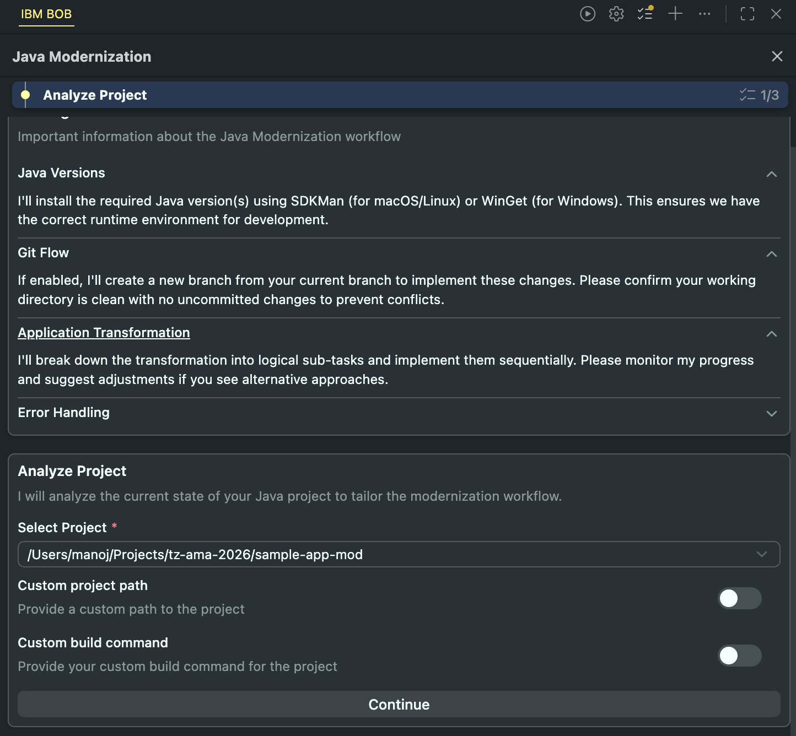

8. Click **Continue**. Bob will analyze the project.

   > **Note:** When Bob asks for approval at any point during the workflow, click **Approve** to allow it to proceed.

**Step 4 — Provide the AMA migration plan**

9. Bob confirms it will proceed with the Liberty Modernization flow and prompts: *"Please provide the path to your Migration plan generated from Application Modernization Accelerator (AMA)."*

   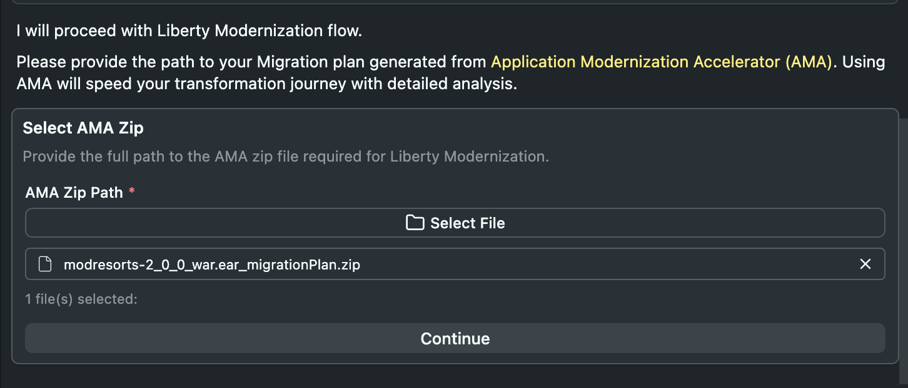

10. Click **Select File** under **AMA Zip Path** and select the migration plan zip file you downloaded from AMA in section 3.3 (`modresorts-2_0_0_war.ear_migrationPlan.zip`).

11. Click **Continue**. Bob will parse the migration plan, apply the required recipes, and automatically make all necessary code changes.

**Step 5 — Review changes and deploy locally**

12. Bob applies the code changes, commits them to the new branch, compiles the project, and confirms the build succeeds. You will see a summary showing how many files were changed (e.g. *5 files changed*).

13. Bob then presents the **Deploy & Validate** prompt:

    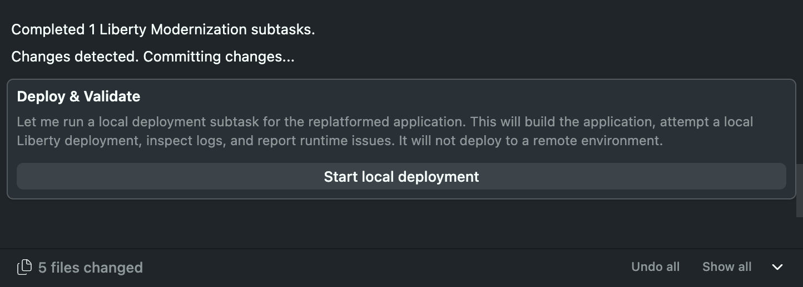

    Click **Start local deployment**. Bob will build the application, start a local Liberty server, inspect the logs, and report any runtime issues.

### 4.3 Testing the modernized application on Liberty

Once Bob has completed the modernization and the build succeeds, you can start the application on a local Liberty server and verify it works correctly.

**Start the Liberty server**

1. In the IBM Bob IDE, open the **Explorer** panel on the left and scroll to the bottom. You will see the **Liberty Dashboard**.

   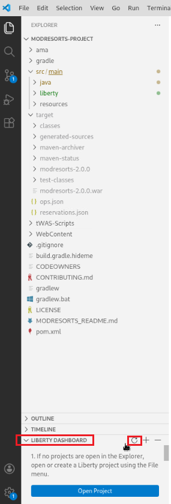

2. In the **Liberty Dashboard**, right-click on **modresorts** and choose **Start**.

   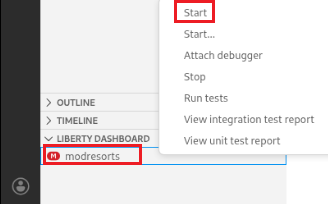

   Liberty will build and start the application. Wait for the server to report that it is ready.

**Test the application in the browser**

3. Open **Firefox** and navigate to:

   **http://localhost:9080/resorts/**

   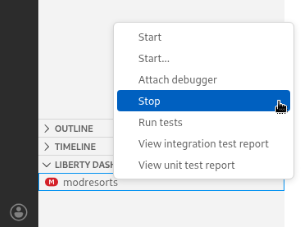

4. The ModResorts application opens. Click the **Where to?** dropdown and select a destination such as **Cork, Ireland** or **Paris, France**. The page should render with weather details and no errors.

   

   **Congratulations — ModResorts is now running on Liberty!**

5. Click the **Logout** button and verify there are no errors.

**Stop the Liberty server**

6. Switch back to IBM Bob. In the **Liberty Dashboard**, right-click on **modresorts** and choose **Stop**.

   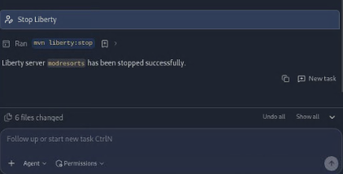

7. Review the **deployment summary** that Bob provides in the chat panel. It confirms the modernization steps completed, files changed, and the branch where the changes were committed.

---

## 5. Getting help and troubleshooting

### 5.1 Reach out to the lab instructor

Lab instructors are available throughout the session to help with any issues and to answer questions about AMA, IBM Bob, and the modernization workflows.

### 5.2 Common troubleshooting tips

**The lab machine becomes unresponsive**
In some cases the remote connection can be lost. Close the window and open the VM Console again.

**AMA is unavailable in Firefox**
If AMA is not responding, restart it from a terminal:
```bash
cd ~/usr/IBM/application-modernization-accelerator-local-5.0.0
./launch.sh q
```
Wait approximately 1–2 minutes and then refresh the browser.

**You have closed the IBM Bob modernization panel and need to reopen it**
1. In the Explorer panel, right-click on any file in the project.
2. At the bottom of the context menu, select **Modernize to Liberty** (for Liberty Modernization) or **Upgrade Java** (for Java Upgrade).

**IBM Bob does not show the Liberty Modernization or Java Upgrade options**
These workflows require the **Java Modernization Premium Package**. Verify that IBM Bob is fully loaded and that the Premium Package is active. If the option is missing, contact a lab instructor.
```

**The application starts but shows errors on the Cork, Ireland page**
Ensure you have completed the Liberty Modernization (section 4) before testing. Remaining issues in the modernization panel may indicate that **Run automated fixes** was not executed.

---

## 6. Lab Reference Materials

| Resource | URL |
|---|---|
| AMA (in VM) | https://localhost:3000 |
| AMA Swagger API (in VM) | https://localhost:2220/openapi/ui/ |
| WAS Admin Console (in VM) | http://localhost:9060/ibm/console |
| ModResorts Local (in VM) | http://localhost:9080/resorts |
| Lab guide (GitHub) | https://github.com/ManojTauro/tx-ama-bob-lab-1456 |
| Download AMA | https://www.ibm.com/account/reg/us-en/subscribe?formid=urx-53705 |
| AMA Documentation | https://www.ibm.com/docs/en/ama |
| IBM Bob | https://www.ibm.com/products/ibm-bob |
| Open Liberty | https://openliberty.io |
| Application Modernization Playbook | https://ibm.github.io/app-mod-journey/tree/index.html |

---

*IBM TechXchange 2026 / © 2026 IBM Corporation*
